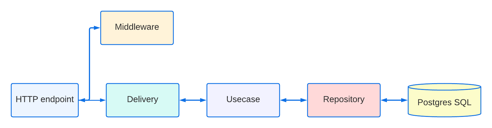

<div align="center">

<h1>🚀 Bookery API</h1>


</div>

## 📦 Packages

- **[Echo](https://github.com/labstack/echo)** - Web framework
- **[Sqlx](https://github.com/jmoiron/sqlx)** - Extensions to database/sql.
- **[Validator](https://github.com/go-playground/validator)** - Go Struct and Field validation
- **[Jwt-go](https://github.com/dgrijalva/jwt-go)** - JSON Web Tokens (JWT)
- **[Migrate](https://github.com/golang-migrate/migrate)** - Database migrations. CLI and Golang library.
- **[Swag](https://github.com/swaggo/swag)** - Swagger
- **[Testify](https://github.com/stretchr/testify)** - Testing toolkit
- **[Docker](https://www.docker.com/)** - Docker

## 📝 Data Flow



## 🔧 Getting Started

> 🚧 You will need [Go](https://go.dev/doc/install), [Docker](https://www.docker.com/get-started/) and [Migrate](https://github.com/golang-migrate/migrate) installed.

1. Clone the repository

```bash
git clone git@github.com:techwithmat/bookery-api.git
```

2. Go to the directory

```bash
cd bookery-api
```

3. Create a **.env** file with the following content:

```bash
# Database Config.
POSTGRES_HOST=
POSTGRES_PORT=
POSTGRES_USER=
POSTGRES_DB=
POSTGRES_PASSWORD=

# Port number that the server will be listening to.
PORT=

# Secret key that will be used to sign the JWT tokens.
JWT_SECRET=
```

4. Once you got those things in place just run the following command.

```bash
# Start docker compose and the server
make docker-up run

# Run migrations
migrate -path ./migrations -database postgres://<db_user>:<db_user_password>@<host>/<database_name>?sslmode=disable up
## or 
migrate -path ./migrations -database postgres://<db_user>:<db_user_password>@<host>/<database_name>?sslmode=disable down
```

## 🔑 License:

- [MIT License](https://github.com/techwithmat/bookery-api/blob/main/LICENSE).